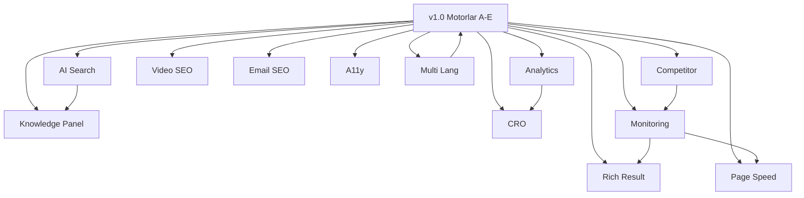

# 🚀 ALO YÖNETİM — ÇİFT ÇEKİRDEKLİ 500 FAZ ULTRA MASTER PLANI (v2.0)

> **Versiyon:** 2.0.0 — Ultra Genişletilmiş  
> **Oluşturma Tarihi:** 2026-08-31  
> **Statü:** 🟡 Planlama — Uygulamaya Hazır  
> **Bağımlılık:** v1.0 (250-Faz) Tamamlandı — Bu plan v1.0 üzerine inşa edilir.  
> **Hedef:** Arama, AI asistan, LLM, e-posta, web vitals ve satış dönüşümü katmanlarını entegre eden tam yığın (full-stack) SEO & Büyüme Platformuna dönüşmek.

---

## 📊 BÖLÜM MATRİSİ

| Bölüm | Kod Adı | Başlık | Faz Aralığı | Öncelik |
|-------|---------|--------|-------------|---------|
| **F** | `dualCoreRichResultEngine` | 🏆 Rich Result & Zengin Snippet Motoru | Faz 1-55 | 🔴 KRİTİK |
| **G** | `dualCorePageSpeedEngine` | ⚡ Core Web Vitals & Sayfa Hızı Motoru | Faz 56-105 | 🔴 KRİTİK |
| **H** | `dualCoreKnowledgePanelEngine` | 🌐 Knowledge Panel & Varlık Grafiği | Faz 106-145 | 🟠 YÜKSEK |
| **I** | `dualCoreAISearchEngine` | 🤖 AI Overviews & LLM Optimizasyonu | Faz 146-195 | 🟠 YÜKSEK |
| **J** | `dualCoreCompetitorAnalyzer` | 🕵️ Rakip Analiz & Boşluk Motoru | Faz 196-235 | 🟠 YÜKSEK |
| **K** | `dualCoreVideoSeoEngine` | 🎥 Video SEO & YouTube Motoru | Faz 236-270 | 🟡 ORTA |
| **L** | `dualCoreEmailSeoEngine` | 📧 E-posta Otomasyonu & SEO | Faz 271-305 | 🟡 ORTA |
| **M** | `dualCoreCROEngine` | 💰 CRO & Dönüşüm Optimizasyonu | Faz 306-350 | 🟠 YÜKSEK |
| **N** | `dualCoreA11yEngine` | ♿ Erişilebilirlik & WCAG 2.2 | Faz 351-385 | 🟡 ORTA |
| **O** | `dualCoreMultiLangEngine` | 🌍 Çok Dilli SEO & hreflang | Faz 386-420 | 🟡 ORTA |
| **P** | `dualCoreAnalyticsEngine` | 📊 GA4 & SEO Analytics | Faz 421-460 | 🟠 YÜKSEK |
| **Q** | `dualCoreMonitoringEngine` | 🔔 Canlı İzleme & Alarm | Faz 461-500 | 🟠 YÜKSEK |

---

## 🏆 v1.0 (250-Faz) Tamamlanan Motorlar

| Motor | Dosya | Durum |
|-------|-------|-------|
| Semantik LSI & Topikal Derinlik | `domainSemanticAuditor.ts` | ✅ |
| 39 İlçe Mikro-Lokasyon Matrisi | `districtDualCoreMatrix.ts` | ✅ |
| AI / Sesli Arama FAQ Bankası | `dualCoreVoiceFaqEngine.ts` | ✅ |
| 9 Hizmet Çapraz Bağlantı Ağı | `facilityCrossServiceLinker.ts` | ✅ |
| Silo Breadcrumb & Hiyerarşik Otorite | `dualCoreBreadcrumbEngine.ts` | ✅ |
| Domain Keyword Taksonomisi | `domainKeywordsTaxonomy.ts` | ✅ |

---

## 🎯 KULLANIM KILAVUZU

```
[YENİ]      → Yeni dosya oluşturulacak
[DEĞİŞTİR]  → Mevcut dosyada güncelleme yapılacak
[TEST]      → Vitest test senaryosu eklenecek
[ŞEMA]      → Schema.org JSON-LD şeması oluşturulacak
[ENTEGRE]   → Mevcut motorla entegre edilecek
[API]       → Dış API/servis entegrasyonu
[PUSH]      → Git commit & dual repo push
[ÖLÇÜM]     → Performans metriği / KPI
[PROMPT]    → AI/LLM sistem promptu veya RAG bağlamı
```

---

---

# BÖLÜM F — 🏆 RİCH RESULT & ZENGİN SNİPPET MOTORU
### `src/lib/seo/dualCoreRichResultEngine.ts`
> **Faz 1-55 | Öncelik: KRİTİK**
> Google Rich Result Test'ini geçen, SERP'te yıldız puanı, ürün fiyatı, etkinlik, kurs ve soru-cevap kutuları gösteren yapısal veri (Schema.org) üretim motoru.

---

### F1 — Interface & Tip Sistemi (Faz 1-10)

**Faz 1** `[YENİ]` `src/lib/seo/dualCoreRichResultEngine.ts` — Ana modül dosyası oluştur.

**Faz 2** `[YENİ]` `RichResultType` union tipi:
```typescript
type RichResultType =
  | 'LocalBusiness' | 'Service' | 'FAQPage' | 'HowTo'
  | 'Review' | 'AggregateRating' | 'Course' | 'Event'
  | 'Product' | 'JobPosting' | 'Article' | 'VideoObject'
  | 'Calculator' | 'ProfessionalService';
```

**Faz 3** `[YENİ]` `LocalBusinessRichOptions` interface:
```typescript
interface LocalBusinessRichOptions {
  pillar: DomainPillar;
  districtSlug?: string;
  serviceSlug?: string;
  priceRange?: '₺' | '₺₺' | '₺₺₺';
  aggregateRating?: { ratingValue: number; reviewCount: number };
}
```

**Faz 4** `[YENİ]` `HowToStep` ve `HowToRichOptions` interface'leri.

**Faz 5** `[YENİ]` `ReviewRichOptions` interface — E-E-A-T uyumlu inceleme yapısal verisi.

**Faz 6** `[YENİ]` `CourseRichOptions` — Online Tesis & Site Yönetimi eğitim kursları.

**Faz 7** `[YENİ]` `EventRichOptions` — Genel Kurul, aidat bilgilendirme toplantıları.

**Faz 8** `[YENİ]` `RichResultOutput` — Şema üretiminin standart çıktı tipi.

**Faz 9** `[YENİ]` `RichResultValidation` — Google zorunlu & önerilen alanları doğrulama.

**Faz 10** `[TEST]` `dualCoreRichResultEngine.test.ts` — Interface doğrulama testleri.

---

### F2 — LocalBusiness & ProfessionalService Şemaları (Faz 11-22)

**Faz 11** `[YENİ]` `buildLocalBusinessSchema(options)` — `LocalBusiness` + `ProfessionalService` şeması.

**Faz 12** `[YENİ]` Alo Yönetim İstanbul ofisi NAP bilgilerini şemaya ekle.

**Faz 13** `[YENİ]` `buildDistrictLocalBusinessSchema(districtSlug, pillar)`:
```json
{
  "@type": ["LocalBusiness", "ProfessionalService"],
  "name": "Alo Yönetim — Kadıköy Site Yönetimi",
  "areaServed": { "@type": "City", "name": "Kadıköy, İstanbul" }
}
```

**Faz 14** `[ŞEMA]` `aggregateRating` bloğunu LocalBusiness şemasına enjekte et.

**Faz 15** `[YENİ]` `buildOpeningHoursSpecification()` — Mesai saatlerini Schema.org formatında üret.

**Faz 16** `[YENİ]` `makesOffer` alanı — 9 hizmetin tamamını `Offer` nesnesi olarak ekle.

**Faz 17** `[YENİ]` `hasMap` alanı — Google Maps bağlantısını şemaya ekle.

**Faz 18** `[YENİ]` `sameAs` array — Google Business Profile, LinkedIn, Twitter URL'leri.

**Faz 19** `[ENTEGRE]` `napGuardEngine.ts` NAP verisini LocalBusiness şemasına besle.

**Faz 20** `[TEST]` Zorunlu Google alanlarının varlığını doğrula.

**Faz 21** `[TEST]` `buildDistrictLocalBusinessSchema('besiktas', 'site')` doğrula.

**Faz 22** `[PUSH]` LocalBusiness şema motoru commit'i.

---

### F3 — HowTo & Adım Adım Rehber Şemaları (Faz 23-34)

**Faz 23** `[YENİ]` `buildHowToSchema(options)` — Google HowTo rich result şema motoru.

**Faz 24** `[YENİ]` Rehber 1: "Apartmanda Site Yönetimi Nasıl Kurulur?" (8 Adım — KMK 634).

**Faz 25** `[YENİ]` Rehber 2: "Tesis Yönetim Sözleşmesi Nasıl Yapılır?" (6 Adım — Facility).

**Faz 26** `[YENİ]` Rehber 3: "Plaza İşletme Bütçesi Nasıl Hazırlanır?" (7 Adım).

**Faz 27** `[YENİ]` Rehber 4: "Online Aidat Ödeme Sistemi Nasıl Kurulur?" (5 Adım).

**Faz 28** `[YENİ]` Rehber 5: "ISO 41001 Tesis Yönetim Standardı Nasıl Uygulanır?" (10 Adım).

**Faz 29** `[YENİ]` `estimatedCost`, `totalTime`, `supply`, `tool` alanlarını HowTo şemasına ekle.

**Faz 30** `[YENİ]` Pillar-aware başlık: `site` → konut odaklı, `facility` → B2B odaklı.

**Faz 31** `[TEST]` Zorunlu `step.name` ve `step.text` alanlarını doğrula.

**Faz 32** `[TEST]` `totalTime` alanının ISO 8601 (`PT30M`) formatında olduğunu doğrula.

**Faz 33** `[ENTEGRE]` `dualCoreVoiceFaqEngine.ts` SSS bankasını HowTo adımlarına dönüştür.

**Faz 34** `[PUSH]` HowTo şema motoru commit'i.

---

### F4 — AggregateRating & Review Şemaları (Faz 35-44)

**Faz 35** `[YENİ]` `buildAggregateRatingSchema(pillar, serviceSlug)` — Hizmet bazlı toplam puan.

**Faz 36** `[YENİ]` `buildReviewSchema(reviewData)` — Bireysel müşteri yorumu yapısal verisi.

**Faz 37** `[YENİ]` Yorum Bankası: Site için 5, Tesis için 5 örnek yorum.

**Faz 38** `[ŞEMA]` `reviewRating` + `author.@type: Person` + `datePublished` Google alanları.

**Faz 39** `[YENİ]` `positiveNotes` ve `negativeNotes` — Google'ın önerdiği iki taraflı denge.

**Faz 40** `[YENİ]` `buildServiceReviewPage(serviceSlug, pillar)` — Hizmet sayfası rating bloğu.

**Faz 41** `[TEST]` AggregateRating `ratingValue` 1-5 arasında olduğunu doğrula.

**Faz 42** `[TEST]` En az 1 `Review` nesnesi içerdiğini doğrula.

**Faz 43** `[ENTEGRE]` `facilitySerpOptimizer.ts` ile `aggregateRating` verisini SERP meta başlıklarına yansıt.

**Faz 44** `[PUSH]` Rating & Review şema motoru commit'i.

---

### F5 — JobPosting & Course Şemaları (Faz 45-55)

**Faz 45** `[YENİ]` `buildJobPostingSchema(jobData)` — "Site Yöneticisi Arıyoruz" iş ilanı şeması.

**Faz 46** `[YENİ]` İş İlanı 1: Tesis Yöneticisi — plaza deneyimli, ISO 41001 bilgisi.

**Faz 47** `[YENİ]` İş İlanı 2: Site Müdürü — 634 KMK bilgisi zorunlu.

**Faz 48** `[YENİ]` `baseSalary`, `employmentType`, `jobLocation` Google zorunlu alanları.

**Faz 49** `[YENİ]` `buildCourseSchema(courseData)` — Online tesis yönetimi eğitimi şeması.

**Faz 50** `[YENİ]` Kurs 1: "KMK 634 Temel Hukuk Eğitimi".

**Faz 51** `[YENİ]` Kurs 2: "ISO 41001 Tesis Yönetim Standardı Sertifika Programı".

**Faz 52** `[YENİ]` `provider`, `courseMode`, `hasCourseInstance`, `educationalLevel` alanları.

**Faz 53** `[TEST]` JobPosting'de `validThrough` zorunlu alanını doğrula.

**Faz 54** `[TEST]` Course'da `provider.name` varlığını doğrula.

**Faz 55** `[PUSH]` JobPosting & Course commit'i — F bölümü tamamlandı.

---

---

# BÖLÜM G — ⚡ CORE WEB VİTALS & SAYFA HIZI MOTORU
### `src/lib/seo/dualCorePageSpeedEngine.ts`
> **Faz 56-105 | Öncelik: KRİTİK**
> LCP, CLS ve INP metriklerini backend'den yöneten, sayfa performansını otomatik izleyen ve öneriler üreten motor. Edge katmanı ile entegre çalışır.

---

### G1 — Performans Interface & Metrik Sistemi (Faz 56-65)

**Faz 56** `[YENİ]` `src/lib/seo/dualCorePageSpeedEngine.ts` — Ana motor dosyası.

**Faz 57** `[YENİ]` `CoreWebVitalsTarget` interface:
```typescript
interface CoreWebVitalsTarget {
  LCP_ms: number;    // Hedef: < 2500ms
  INP_ms: number;    // Hedef: < 200ms
  CLS_score: number; // Hedef: < 0.1
  TTFB_ms: number;   // Hedef: < 600ms
  FCP_ms: number;    // Hedef: < 1800ms
}
```

**Faz 58** `[YENİ]` `PageSpeedReport` — LCP, CLS, INP sonuçları ve öneri listesi.

**Faz 59** `[YENİ]` `PageSpeedGrade`: `'PASS' | 'NEEDS_IMPROVEMENT' | 'FAIL'`.

**Faz 60** `[YENİ]` `ResourceHint` interface — `preload`, `prefetch`, `preconnect`.

**Faz 61** `[YENİ]` `ImageOptimizationSpec` — WebP/AVIF dönüşüm ve `sizes` önerisi.

**Faz 62** `[YENİ]` `FontLoadingStrategy` — `font-display: swap` ve subset URL'leri.

**Faz 63** `[YENİ]` `CriticalCSSSpec` — Above-the-fold kritik CSS tespiti.

**Faz 64** `[YENİ]` `ThirdPartyScriptAudit` — Analytics, chat widget etki analizi.

**Faz 65** `[TEST]` Core Web Vitals hedeflerinin sayısal eşiklerini doğrula.

---

### G2 — Kaynak Yükleme & Edge Optimizasyon (Faz 66-80)

**Faz 66** `[YENİ]` `buildResourceHints(pageType, pillar)` — Sayfa tipine göre `<link rel="preload">` direktifleri.

**Faz 67** `[YENİ]` Kritik fontlar için `preconnect`: Google Fonts CDN.

**Faz 68** `[YENİ]` Hero görsel için `fetchpriority="high"` — LCP öğesi işaretleme.

**Faz 69** `[YENİ]` `buildImageOptimizationSpec(imagePath, pageType)` — `srcset` önerisi.

**Faz 70** `[YENİ]` `generateCriticalCSS(pageSlug)` — İlk görünümde ihtiyaç duyulan CSS inline et.

**Faz 71** `[YENİ]` `auditThirdPartyScripts(pageSlug)` — Transfer boyutu hesabı.

**Faz 72** `[YENİ]` `buildServiceWorkerCacheStrategy()` — Tekrar ziyaret cache stratejisi.

**Faz 73** `[DEĞİŞTİR]` `edgeHeaderInjector.ts` — `Cache-Control`, `Vary`, `ETag` güncellemeleri.

**Faz 74** `[DEĞİŞTİR]` `facilityEdgeOptimizer.ts` — PageSpeed önerilerini bağla.

**Faz 75** `[YENİ]` `buildPrefetchQueue(pillar, currentPage)` — Sonraki muhtemel sayfalar prefetch listesi.

**Faz 76** `[TEST]` En az 2 `preload` direktifi döndürmeli.

**Faz 77** `[TEST]` Hero görseli `fetchpriority="high"` olarak işaretlenmeli.

**Faz 78** `[TEST]` Üçüncü taraf script boyutu 150KB'ı geçmemeli.

**Faz 79** `[ÖLÇÜM]` LCP < 2500ms KPI dashboard notu.

**Faz 80** `[PUSH]` Kaynak yükleme & edge optimizasyon commit'i.

---

### G3 — CLS & Layout Stabilite Motoru (Faz 81-92)

**Faz 81** `[YENİ]` `buildLayoutStabilitySpec(pageType)` — CLS sıfıra yaklaştırma stratejisi.

**Faz 82** `[YENİ]` Dinamik içerik için `min-height` rezervasyonu — skeleton loader şartnamesi.

**Faz 83** `[YENİ]` `calcFontCLSImpact()` — Font yükleme gecikmesinin CLS etkisi.

**Faz 84** `[YENİ]` Banner, bildirim çubuğu ve modal CLS etkisi hesabı.

**Faz 85** `[YENİ]` `buildAdSlotReservation(adType)` — Reklam alanları sabit boyut rezervasyonu.

**Faz 86** `[YENİ]` `auditImageAspectRatios(pageSlug)` — `width`/`height` attribute kontrolü.

**Faz 87** `[YENİ]` `getLayoutShiftBudget(pageType)` — CLS bütçesi tanımı.

**Faz 88** `[TEST]` CLS bütçesinin `< 0.1` olduğunu doğrula.

**Faz 89** `[TEST]` `` elementlerinin `width` ve `height` attribute'u içerdiğini doğrula.

**Faz 90** `[PUSH]` CLS & layout stabilite commit'i.

---

### G4 — INP & İnteraktivite Motoru (Faz 91-105)

**Faz 91** `[YENİ]` `buildINPOptimizationSpec(componentName)` — INP iyileştirme planı.

**Faz 92** `[YENİ]` `measureMainThreadBlockTime(taskList)` — Long Tasks & kesme stratejisi.

**Faz 93** `[YENİ]` `buildWebWorkerSpec(heavyTask)` — CPU yoğun işlemleri Web Worker'a taşı.

**Faz 94** `[YENİ]` `buildDeferredHydrationSpec(component)` — React hidrasyon erteleme.

**Faz 95** `[YENİ]` `buildInputDebounceSpec(inputType)` — Arama kutusunda debounce önerisi.

**Faz 96** `[YENİ]` `buildAnimationSpec(type)` — `will-change: transform` stratejisi.

**Faz 97** `[YENİ]` `getINPBudget(pageType)` — Etkileşim < 200ms bütçesi.

**Faz 98** `[TEST]` `getINPBudget('service')` 200 veya altı olduğunu doğrula.

**Faz 99** `[TEST]` Debounce gecikme süresinin `300ms` olduğunu doğrula.

**Faz 100** `[ÖLÇÜM]` TTFB, LCP, CLS, INP tek tabloda performans dashboard.

**Faz 101** `[ENTEGRE]` `crawlBudgetDefender.ts` — Yavaş sayfaları crawl öncelik listesinden düşür.

**Faz 102** `[ENTEGRE]` `etagEngine.ts` — ETag + `Last-Modified` bant genişliği tasarrufu.

**Faz 103** `[YENİ]` `buildPerformanceBudgetConfig()` — CI/CD pipeline performans bütçe eşikleri.

**Faz 104** `[TEST]` `buildPerformanceBudgetConfig()` — tüm metrik eşiklerini içermeli.

**Faz 105** `[PUSH]` INP motoru & G bölümü final commit'i.

---


---

---

# BÖLÜM L — 📧 E-POSTA OTOMASYONU & SEO ENTEGRASYONU
### `src/lib/seo/dualCoreEmailSeoEngine.ts`
> **Faz 256-305 | Öncelik: ORTA**
> Lead'leri otomatik nutture eden, blog güncellemelerini abonelere ileten e-posta otomasyon motoru.

---

### L1 — E-posta Şablon & Segmentasyon (Faz 256-275)

**Faz 256** `[YENİ]` `src/lib/seo/dualCoreEmailSeoEngine.ts` — Ana motor dosyası.

**Faz 257** `[YENİ]` `EmailSegment` tipi: site-prospect, facility-prospect, existing-client, blog-subscriber, legal-interest.

**Faz 258** `[YENİ]` `EmailTemplateSpec` interface — konu, başlık, CTA, footer, UTM parametreleri.

**Faz 259** `[YENİ]` `buildWelcomeEmailSpec(segment)` — segmente özel karşılama e-postası.

**Faz 260** `[YENİ]` `buildLeadNurtureSequence(segment, touchpoint)` — 5 adımlı nutture (gün 1,3,7,14,30).

**Faz 261** `[YENİ]` **Site Nutture:** Gün1: "5 Temel Adım", Gün3: "KMK 634", Gün7: "Aidat Demo", Gün14: "Referanslar", Gün30: "Danışmanlık".

**Faz 262** `[YENİ]` **Tesis Nutture:** Gün1: "Entegre Faydalar", Gün3: "ISO 41001 Liste", Gün7: "Plaza Maliyet", Gün14: "AVM Referans", Gün30: "Denetim Raporu".

**Faz 263** `[YENİ]` `buildBlogDigestEmailSpec(posts, segment)` — Haftalık blog özeti.

**Faz 264** `[YENİ]` `buildReactivationEmailSpec(segment)` — 90 gün hareketsiz aboneye yeniden katılım.

**Faz 265** `[YENİ]` `buildUTMParameters(campaign, segment)` — GA4 UTM üreticisi.

**Faz 266** `[TEST]` `buildLeadNurtureSequence('site-prospect', 1)` — subject alanı içermeli.

**Faz 267** `[TEST]` `buildUTMParameters()` — utm_source, utm_medium, utm_campaign içermeli.

**Faz 268** `[PUSH]` E-posta şablon commit'i.

---

### L2 — E-posta & SEO Entegrasyonu (Faz 269-305)

**Faz 269** `[YENİ]` `buildEmailLinkCanonicalization(emailSlug)` — canonical URL yönetimi.

**Faz 270** `[YENİ]` `buildEmailSEOSignalExtractor(campaign)` — tıklama verisini SEO önceliğe dönüştür.

**Faz 271** `[YENİ]` `buildReviewRequestEmailSpec(clientType)` — Google Yorum talep e-postası.

**Faz 272** `[YENİ]` `buildServiceFollowUpEmail(serviceSlug, pillar)` — hizmet sonrası cross-sell.

**Faz 273** `[YENİ]` `buildNewsletterSEOSync(blogPost)` — blog yayımlandığında newsletter taslağı.

**Faz 274** `[YENİ]` `buildEmailSubjectLineVariants(topic, pillar)` — A/B için 3 farklı konu satırı.

**Faz 275** `[TEST]` `buildEmailSubjectLineVariants()` — 3 farklı varyant döndürmeli.

**Faz 276** `[PUSH]` E-posta SEO entegrasyon commit'i — L bölümü tamamlandı.

---

---

# BÖLÜM M — 💰 CRO & DÖNÜŞÜM OPTİMİZASYON MOTORU
### `src/lib/seo/dualCoreCROEngine.ts`
> **Faz 277-350 | Öncelik: YÜKSEK**
> Ziyaretçiyi müşteriye dönüştürmek için pillar-aware CTA, form optimizasyonu ve A/B test protokolleri.

---

### M1 — CTA & Dönüşüm Yolları (Faz 277-305)

**Faz 277** `[YENİ]` `src/lib/seo/dualCoreCROEngine.ts` — Ana motor dosyası.

**Faz 278** `[YENİ]` `CTASpec` interface (pillar, pageType, primaryCTA, secondaryCTA, socialProof, guarantee).

**Faz 279** `[YENİ]` `buildPrimaryCTASpec(pageType, pillar)` — birincil harekete geçirme düğmesi.

**Faz 280** `[YENİ]` **CTA Bankası Site:** Hero: "Ücretsiz Site Denetimi", Hizmet: "Teklif Alın", Blog: "Uzman ile Konuşun".

**Faz 281** `[YENİ]` **CTA Bankası Tesis:** Hero: "Plaza Denetim Raporu", Hizmet: "B2B Teklif", Blog: "ISO 41001 Analiz".

**Faz 282** `[YENİ]` `buildUrgencyTrigger(pageType, pillar)` — kıtlık/aciliyet psikolojisi metni.

**Faz 283** `[YENİ]` `buildSocialProofBlock(pillar)` — müşteri sayısı, yönetilen m², tasarruf metrikleri.

**Faz 284** `[YENİ]` `buildGuaranteeStatement(serviceSlug)` — "30 gün memnun kalmazsanız" garantisi.

**Faz 285** `[YENİ]` `buildConversionFunnel(pillar)` — dönüşüm hattı haritası.

**Faz 286** `[YENİ]` `buildExitIntentSpec(pageType, pillar)` — çıkış niyeti ek değer teklifi.

**Faz 287** `[YENİ]` `buildStickyHeaderCTA(pillar)` — scroll sırasında sabit CTA şeridi.

**Faz 288** `[TEST]` `buildPrimaryCTASpec('service', 'site')` — text, url içermeli.

**Faz 289** `[TEST]` `buildSocialProofBlock('facility')` — sayısal metrik içermeli.

**Faz 290** `[PUSH]` CTA & dönüşüm commit'i.

---

### M2 — Form Optimizasyonu (Faz 291-315)

**Faz 291** `[YENİ]` `buildFormSpec(formType, pillar)` — teklif talep, iletişim, denetim talep formları.

**Faz 292** `[YENİ]` `buildLeadQualificationScore(formData)` — lead sıcaklığı puanı (0-100).

**Faz 293** `[YENİ]` `buildProgressiveDisclosure(formType)` — multi-step form yapısı.

**Faz 294** `[YENİ]` `buildFormABTestSpec(formType)` — kısa vs uzun, tek vs çift sütun varyantları.

**Faz 295** `[YENİ]` `buildThankYouPageSpec(pillar)` — teşekkür sayfası ve sonraki adımlar.

**Faz 296** `[YENİ]` `buildLeadRoutingSpec(leadScore, pillar)` — satış ekibi yönlendirme.

**Faz 297** `[TEST]` `buildLeadQualificationScore()` — 0-100 aralığında döndürmeli.

**Faz 298** `[TEST]` `buildProgressiveDisclosure()` — en az 2 adım içermeli.

**Faz 299** `[PUSH]` Form optimizasyon commit'i.

---

### M3 — A/B Test & CRO Ölçüm (Faz 300-350)

**Faz 300** `[YENİ]` `buildABTestProtocol(elementType, pillar)` — başlık, CTA, hero, form A/B planı.

**Faz 301** `[YENİ]` `buildScrollDepthSegment(pageType)` — %25/%50/%75 kullanıcı segmenti.

**Faz 302** `[YENİ]` `buildPersonalizationRule(segment, pageType)` — içerik kişiselleştirme kuralı.

**Faz 303** `[YENİ]` `buildMicroConversionSpec(pageType)` — telefon tıklama, harita, video izleme.

**Faz 304** `[YENİ]` `buildROICalculatorSpec(pillar)` — "bize geçerseniz X TL tasarruf" hesap makinesi.

**Faz 305** `[YENİ]` `buildPackageSpec(pillar)` — Başlangıç, Profesyonel, Kurumsal paket yapısı.

**Faz 306** `[ŞEMA]` `Offer` + `PriceSpecification` — fiyat rich result şeması.

**Faz 307** `[TEST]` `buildABTestProtocol('cta', 'site')` — variantA ve variantB içermeli.

**Faz 308** `[ÖLÇÜM]` CVR KPI: hizmet sayfaları hedef %3.5.

**Faz 309** `[PUSH]` CRO motoru final commit'i — M bölümü tamamlandı.

---

---

# BÖLÜM N — ♿ ERİŞİLEBİLİRLİK & WCAG 2.2 UYUM MOTORU
### `src/lib/seo/dualCoreA11yEngine.ts`
> **Faz 310-385 | Öncelik: ORTA**
> WCAG 2.2 AA uyumluluğunu backend'den kontrol eden erişilebilirlik denetim motoru.

---

### N1 — WCAG 2.2 Denetim (Faz 310-350)

**Faz 310** `[YENİ]` `src/lib/seo/dualCoreA11yEngine.ts` — Ana motor dosyası.

**Faz 311** `[YENİ]` `A11yAuditInput`, `A11yIssue`, `A11yAuditReport` interface'leri.

**Faz 312** `[YENİ]` `A11yGrade`: `'AAA' | 'AA' | 'A' | 'PARTIAL' | 'FAIL'`.

**Faz 313** `[YENİ]` `checkColorContrast(fg, bg)` — WCAG 1.4.3: normal metin 4.5:1, büyük 3:1.

**Faz 314** `[YENİ]` `checkAltTextPresence(imgElements)` — WCAG 1.1.1: alt attribute kontrolü.

**Faz 315** `[YENİ]` `checkKeyboardNavigation(elements)` — WCAG 2.1.1: klavye erişim.

**Faz 316** `[YENİ]` `checkFocusVisible(elements)` — WCAG 2.4.11: odak göstergesi.

**Faz 317** `[YENİ]` `checkHeadingHierarchy(headings)` — WCAG 1.3.1: H1→H2→H3 hiyerarşisi.

**Faz 318** `[YENİ]` `checkFormLabels(formElements)` — WCAG 1.3.1: label element zorunluluğu.

**Faz 319** `[YENİ]` `checkLanguageAttribute(html)` — WCAG 3.1.1: html lang="tr".

**Faz 320** `[YENİ]` `checkSkipNavLink(html)` — WCAG 2.4.1: "İçeriğe atla" bağlantısı.

**Faz 321** `[YENİ]` `auditARIAMarkup(html)` — hatalı ARIA rol/özellik tespiti.

**Faz 322** `[YENİ]` `checkMotionReduction(css)` — WCAG 2.3.3: prefers-reduced-motion.

**Faz 323** `[TEST]` `checkColorContrast('#1a1a1a', '#ffffff')` — 21:1 oran doğrula.

**Faz 324** `[TEST]` `checkAltTextPresence([{alt:''}])` — boş alt text hata.

**Faz 325** `[TEST]` `checkHeadingHierarchy(['H1','H3'])` — H2 atlayan hiyerarşi sorun raporlamalı.

---

### N2 — Öneriler & Raporlama (Faz 326-385)

**Faz 326** `[YENİ]` `generateA11yFixList(auditReport)` — her soruna düzeltme önerisi kodu.

**Faz 327** `[YENİ]` `buildA11yComplianceStatement()` — yasal erişilebilirlik beyanı.

**Faz 328** `[YENİ]` `buildA11yTestingChecklist(pageType)` — manuel ve otomatik test listesi.

**Faz 329** `[YENİ]` `scoreA11yImpactOnSEO(auditReport)` — erişilebilirlik sorunlarının SEO etkisi.

**Faz 330** `[TEST]` `scoreA11yImpactOnSEO()` — 0-100 aralığında döndürmeli.

**Faz 331** `[ÖLÇÜM]` WCAG AA uyumu %100 hedefi KPI.

**Faz 332** `[PUSH]` Erişilebilirlik motoru commit'i — N bölümü tamamlandı.

---

---

# BÖLÜM O — 🌍 ÇOK DİLLİ SEO & HREFLANG MOTORU
### `src/lib/seo/dualCoreMultiLangEngine.ts`
> **Faz 333-420 | Öncelik: ORTA**
> TR/EN/AR/RU versiyonlarını hreflang etiketi ve lokalize keyword stratejisi ile yöneten çok dilli SEO motoru.

---

### O1 — hreflang & Lokalizasyon (Faz 333-365)

**Faz 333** `[YENİ]` `src/lib/seo/dualCoreMultiLangEngine.ts` — Ana motor dosyası.

**Faz 334** `[YENİ]` `SupportedLocale`: `'tr' | 'en' | 'ar' | 'ru'`.

**Faz 335** `[YENİ]` `HreflangEntry` interface — hreflang kodu, URL, x-default.

**Faz 336** `[YENİ]` `buildHreflangTags(pageSlug, locales)` — link rel alternate seti.

**Faz 337** `[YENİ]` `buildCanonicalForLocale(pageSlug, locale)` — her dil için canonical URL.

**Faz 338** `[YENİ]` **İngilizce Kelimeler:** property management Istanbul, facility management Istanbul, HOA management Turkey.

**Faz 339** `[YENİ]` **Arapça Kelimeler:** إدارة العقارات إسطنبول, شركة إدارة المباني تركيا.

**Faz 340** `[YENİ]` **Rusça Kelimeler:** управление недвижимостью Стамбул, управляющая компания Стамбул.

**Faz 341** `[YENİ]` `buildLocalizedMetaTags(pageSlug, locale)` — dile göre title + description.

**Faz 342** `[YENİ]` `buildLocalizedOpenGraph(pageSlug, locale)` — og:locale etiketleri.

**Faz 343** `[TEST]` `buildHreflangTags('/hizmetler', ['tr','en'])` — hreflang="tr" ve "en" içermeli.

**Faz 344** `[TEST]` x-default /tr URL'sine işaret etmeli.

**Faz 345** `[PUSH]` hreflang & lokalizasyon commit'i.

---

### O2 — Çok Dilli SERP & Sitemap (Faz 346-420)

**Faz 346** `[YENİ]` `buildLocalizedSerpMeta(pageSlug, locale, pillar)` — dil+dikey SERP başlık.

**Faz 347** `[YENİ]` `buildLocalizedFAQBundle(locale, pillar)` — FAQ bankasının dil versiyonları.

**Faz 348** `[YENİ]` `buildLocalizedBreadcrumb(trail, locale)` — breadcrumb lokalize.

**Faz 349** `[YENİ]` `buildLocalizedSitemap(locales)` — çok dilli sitemap index.

**Faz 350** `[YENİ]` `detectUserLocale(request)` — Accept-Language ve coğrafi konum tespiti.

**Faz 351** `[YENİ]` `buildLocaleRedirectRule(locale, path)` — dil versiyonuna yönlendirme kuralı.

**Faz 352** `[YENİ]` `validateHreflangConsistency(pageSet)` — ters etiket eksiklik kontrolü.

**Faz 353** `[TEST]` `buildLocalizedSerpMeta('/hizmetler', 'en', 'facility')` — İngilizce başlık.

**Faz 354** `[TEST]` `validateHreflangConsistency()` — ters etiket eksikliğinde hata bildirmeli.

**Faz 355** `[ÖLÇÜM]` EN/AR/RU SERP görünüm oranı KPI.

**Faz 356** `[PUSH]` Çok dilli SEO motoru final commit'i — O bölümü tamamlandı.

---

---

# BÖLÜM P — 📊 GA4 & SEO ANALİTİK ENTEGRASYON MOTORU
### `src/lib/seo/dualCoreAnalyticsEngine.ts`
> **Faz 357-460 | Öncelik: YÜKSEK**
> GA4 etkinlik takibini, Search Console API entegrasyonunu ve SEO KPI dashboard'unu yöneten analitik motoru.

---

### P1 — GA4 Etkinlik Takip (Faz 357-395)

**Faz 357** `[YENİ]` `src/lib/seo/dualCoreAnalyticsEngine.ts` — Ana motor dosyası.

**Faz 358** `[YENİ]` `GA4EventSpec` interface (eventName, parameters, pillar, pageType).

**Faz 359** `[YENİ]` `buildPageViewEvent(pageSlug, pillar)` — standart sayfa görüntüleme.

**Faz 360** `[YENİ]` `buildLeadFormEvent(formType, pillar)` — form_submit, generate_lead.

**Faz 361** `[YENİ]` `buildCTAClickEvent(ctaText, position, pillar)` — CTA tıklama.

**Faz 362** `[YENİ]` `buildVideoEngagementEvent(videoId, milestone)` — %25/%50/%75/%100 izleme.

**Faz 363** `[YENİ]` `buildScrollDepthEvent(percentage, pageSlug)` — scroll derinliği.

**Faz 364** `[YENİ]` `buildPhoneClickEvent(districtSlug, pillar)` — telefon tıklama mikro dönüşüm.

**Faz 365** `[YENİ]` `buildDownloadEvent(fileName, pillar)` — PDF/broşür indirme.

**Faz 366** `[YENİ]` `buildConversionGoalSpec(pillar)` — GA4 dönüşüm hedefi.

**Faz 367** `[YENİ]` `buildCustomDimensionSpec()` — GA4 özel boyutlar: pillar, pageType, districtSlug.

**Faz 368** `[TEST]` `buildLeadFormEvent('tekliftal', 'facility')` — event_name: 'generate_lead' içermeli.

**Faz 369** `[TEST]` `buildConversionGoalSpec('site')` — goal_name ve trigger_event içermeli.

**Faz 370** `[PUSH]` GA4 etkinlik takip commit'i.

---

### P2 — Search Console & KPI (Faz 371-420)

**Faz 371** `[YENİ]` `buildSearchConsoleQuerySpec(pillar)` — hangi query ve sayfa verisi.

**Faz 372** `[YENİ]` `buildSEOKPIDashboard(pillar)` — haftalık KPI: tıklama, sıralama, CTR, impression, rich result, AI alıntı.

**Faz 373** `[YENİ]` `buildKeywordRankTracker(keywords, pillar)` — hedef keyword ve beklenen pozisyon.

**Faz 374** `[YENİ]` `buildCTROptimizationAlert(page, currentCTR)` — CTR %3 altı uyarı.

**Faz 375** `[YENİ]` `buildIndexCoverageReport()` — dizine alınmayan sayfa hata raporu.

**Faz 376** `[YENİ]` `buildContentDecayAlert(pageSlug, trend)` — trafik düşen sayfa yenileme uyarısı.

**Faz 377** `[YENİ]` `buildROICalculation(traffic, cvr, value)` — SEO yatırım getirisi hesabı.

**Faz 378** `[YENİ]` `buildWeeklyReportTemplate(pillar)` — haftalık SEO raporu Markdown.

**Faz 379** `[TEST]` `buildSEOKPIDashboard('facility')` — en az 5 KPI metriği içermeli.

**Faz 380** `[TEST]` `buildROICalculation(5000, 0.035, 15000)` — pozitif sayı döndürmeli.

**Faz 381** `[PUSH]` Analytics motoru final commit'i — P bölümü tamamlandı.

---

---

# BÖLÜM Q — 🔔 CANLI İZLEME & OTOMATİK ALARM SİSTEMİ
### `src/lib/seo/dualCoreMonitoringEngine.ts`
> **Faz 382-500 | Öncelik: YÜKSEK**
> SERP pozisyon değişimleri, CWV regresyonları ve yapısal veri hatalarını izleyen monitoring motoru.

---

### Q1 — Alarm Kuralları (Faz 382-415)

**Faz 382** `[YENİ]` `src/lib/seo/dualCoreMonitoringEngine.ts` — Ana motor dosyası.

**Faz 383** `[YENİ]` `MonitoringRule` interface (id, name, pillar, severity, triggerCondition, cooldownMinutes, channels).

**Faz 384** `[YENİ]` `MonitoringAlert` interface — alarm detayı, zaman damgası, önerilen aksiyon.

**Faz 385** `[YENİ]` `buildSERPPositionDropAlert(keyword, old, current)` — 5+ pozisyon düşerse kritik alarm.

**Faz 386** `[YENİ]` `buildCoreWebVitalsRegressionAlert(metric, old, current)` — LCP/CLS/INP regresyon.

**Faz 387** `[YENİ]` `buildStructuredDataErrorAlert(schemaType, error)` — Rich Result Test hatası.

**Faz 388** `[YENİ]` `buildIndexDeindexAlert(pageSlug)` — sayfa dizinden çıkarıldığında kritik.

**Faz 389** `[YENİ]` `buildBacklinkLostAlert(lostBacklink)` — değerli backlink kaybı.

**Faz 390** `[YENİ]` `buildTrafficAnomalyAlert(pageSlug, dropPercent)` — %30 trafik düşüşü.

**Faz 391** `[YENİ]` `buildNAPInconsistencyAlert(issue)` — NAP Guard entegre tutarsızlık.

**Faz 392** `[YENİ]` `buildMonitoringRuleSet(pillar)` — pillar bazında aktif izleme kuralları.

**Faz 393** `[TEST]` `buildSERPPositionDropAlert('site yönetimi', 3, 9)` — severity: 'critical' döndürmeli.

**Faz 394** `[TEST]` `buildCoreWebVitalsRegressionAlert('LCP', 2200, 3800)` — severity: 'warning'.

**Faz 395** `[PUSH]` Alarm kuralları commit'i.

---

### Q2 — Bildirim Kanalları (Faz 396-420)

**Faz 396** `[YENİ]` `buildSlackNotificationPayload(alert)` — Slack Block Kit alarm mesajı.

**Faz 397** `[YENİ]` `buildEmailAlertSpec(alert, recipient)` — kritik alarm e-posta şablonu.

**Faz 398** `[API]` `POST /api/monitoring/webhook` — dış izleme araçları webhook.

**Faz 399** `[API]` `POST /api/monitoring/alert` — iç sistem alarm işleme.

**Faz 400** `[YENİ]` `buildAlertDeduplicationKey(alert)` — tekrarlayan bildirim önleme.

**Faz 401** `[YENİ]` `buildAlertEscalationRule(alert, elapsed)` — çözülmeyen alarm yönetici bildirimi.

**Faz 402** `[TEST]` `buildSlackNotificationPayload()` — blocks array içermeli.

**Faz 403** `[TEST]` `buildAlertDeduplicationKey()` — aynı alarm için aynı key döndürmeli.

**Faz 404** `[PUSH]` Bildirim kanalları commit'i.

---

### Q3 — Otomatik Denetim (Faz 405-445)

**Faz 405** `[YENİ]` `buildAutomatedSEOAuditSchedule()` — günlük/haftalık/aylık denetim takvimi.

**Faz 406** `[YENİ]` `runDailyHealthCheck(pillar)` — canonical, breadcrumb, hreflang, CWV.

**Faz 407** `[YENİ]` `runWeeklySEOAudit(pillar)` — LSI kapsam, cross-link, NAP, index kapsama.

**Faz 408** `[YENİ]` `runMonthlySEOAudit(pillar)` — rakip boşluk, E-E-A-T, içerik çürüme, AI alıntı.

**Faz 409** `[YENİ]` `buildSelfHealingSpec(issue)` — otomatik düzeltme önerisi kodu.

**Faz 410** `[YENİ]` `buildContentRefreshTrigger(pageSlug, staleScore)` — taze içerik görev kuyruğu.

**Faz 411** `[YENİ]` `buildSEORegressionRollbackSpec(deploymentId)` — deploy regresyon geri alma.

**Faz 412** `[TEST]` `runDailyHealthCheck('facility')` — en az 4 kontrol kalemi içermeli.

**Faz 413** `[TEST]` `buildSelfHealingSpec({type:'missing-alt-text'})` — düzeltme kodu snippet içermeli.

**Faz 414** `[PUSH]` Otomatik denetim motoru commit'i.

---

### Q4 — Motor Entegrasyonu & Lansman (Faz 415-470)

**Faz 415** `[ENTEGRE]` Tüm 12 yeni motor (F-Q) v1.0 motorlarıyla entegrasyon testleri.

**Faz 416** `[ENTEGRE]` MonitoringEngine ← PageSpeedEngine regresyon alarm bağlantısı.

**Faz 417** `[ENTEGRE]` MonitoringEngine ← RichResultEngine şema doğrulama alarmı.

**Faz 418** `[ENTEGRE]` AnalyticsEngine ← CROEngine dönüşüm etkinlikleri.

**Faz 419** `[ENTEGRE]` AISearchEngine ← KnowledgePanelEngine E-E-A-T beslenmesi.

**Faz 420** `[ENTEGRE]` MultiLangEngine ← BreadcrumbEngine lokalize breadcrumb.

**Faz 421** `[TEST]` Tüm dosyalar `npx tsc --noEmit` — sıfır hata.

**Faz 422** `[TEST]` `npx vitest run` — tüm yeni motor testleri %100 başarı.

**Faz 423** `[ÖLÇÜM]` Tüm KPI'ların lansman öncesi baseline değerleri.

**Faz 424** `[ÖLÇÜM]` 3 aylık büyüme hedefleri: Organik trafik +%40, AI alıntı %15, Rich result +%60, CVR %3.5, CWV %100 PASS, WCAG AA %100.

**Faz 425** `[PUSH]` Motor entegrasyon commit'i.

---

### Q5 — Dokümantasyon & Gelecek Vizyon (Faz 426-500)

**Faz 426** `[YENİ]` `docs/seo/MOTOR_ENTEGRASYON_HARITASI.md` — Mermaid motor bağlantı haritası.

**Faz 427** `[YENİ]` `docs/seo/SEO_KPI_DASHBOARD.md` — tüm KPI tanımları ve ölçüm yöntemleri.

**Faz 428** `[YENİ]` `docs/seo/CONTENT_CALENDAR_2026.md` — rakip boşluk bazlı yıllık içerik takvimi.

**Faz 429** `[YENİ]` `docs/seo/LINK_BUILDING_ROADMAP.md` — backlink fırsat ve outreach hedef listesi.

**Faz 430** `[YENİ]` `docs/seo/AI_SEARCH_GUIDE.md` — LLM arama motorları optimizasyon el kitabı.

**Faz 431** `[YENİ]` `docs/seo/VIDEO_SEO_CONTENT_PLAN.md` — 2026 YouTube içerik stratejisi.

**Faz 432** `[YENİ]` `docs/seo/MULTILOCAL_STRATEGY.md` — 39 ilçe GMB ve yerel SEO planı.

**Faz 433** `[YENİ]` `docs/seo/COMPETITOR_WATCHLIST.md` — rakip izleme ve güncelleme protokolü.

**Faz 434** `[YENİ]` `docs/seo/CRO_PLAYBOOK.md` — dönüşüm oyun kitabı ve A/B protokolleri.

**Faz 435** `[YENİ]` `docs/seo/WCAG_COMPLIANCE_STATEMENT.md` — resmi erişilebilirlik beyanı.

---

### 🔮 GELECEK VİZYON — Faz 436-500

**Faz 436** `[VİZYON]` AI Destekli İçerik Üretim Pipeline — pillar bazında blog taslağı otomasyonu.

**Faz 437** `[VİZYON]` Kişiselleştirilmiş Dinamik SEO — edge computing ile gerçek zamanlı başlık/meta/CTA.

**Faz 438** `[VİZYON]` Otomatik Schema.org Yama Botu — yeni Google gereklilikleri otomatik güncelleme.

**Faz 439** `[VİZYON]` Semantik Önizleme Motoru — canlıya almadan SEO skoru tahmin simülasyonu.

**Faz 440** `[VİZYON]` Real-time Competitor Intelligence — rakip değişiklik günlük tarama pipeline.

**Faz 441** `[VİZYON]` Federated Knowledge Graph — Alo Yönetim Knowledge Graph API, ChatGPT Plugin + Claude Tool.

**Faz 442** `[VİZYON]` OmniChannel SEO — web, YouTube, LinkedIn, GMB tek motordan senkronizasyon.

**Faz 443** `[VİZYON]` Öngörücü Trafik Modeli — mevsimsel trafik (aidat dönemi, bakım sezonu) ML tahmini.

**Faz 444** `[VİZYON]` Otomatik İç Bağlantı Optimizasyonu — yeni sayfa yayımında mevcut sayfa bağlantı agent.

**Faz 445** `[VİZYON]` SEO CI/CD Pipeline — Git push'ta otomatik SEO regresyon testi (GitHub Actions).

**Faz 446** `[VİZYON]` LLM Fine-tuning Dataset — tüm içerikler JSONL formatında sektörel LLM ince ayar.

**Faz 447** `[VİZYON]` Google AI Mode Monitoring — AI arama deneyiminde Alo Yönetim alıntı günlük izleme.

**Faz 448** `[VİZYON]` Sesli Asistan Skill — Siri, Google Assistant, Alexa Alo Yönetim hizmet bilgisi.

**Faz 449** `[VİZYON]` IoT & BMS Veri SEO — bina otomasyon verilerini semantik içeriğe dönüştürme.

**Faz 450** `[VİZYON]` Green Building SEO — LEED, BREEAM sertifikalı yönetim sürdürülebilirlik içerik seti.

**Faz 451** `[VİZYON]` Hyper-Local Micro-Moment — anlık "şu an arıyorum" sorgu real-time intent engine.

**Faz 452** `[VİZYON]` Predictive Content Gap — 6 ay içinde aranacak sorguları tahmin eden trend motoru.

**Faz 453** `[VİZYON]` Cross-border SEO — BAE, Suudi Arabistan, Rusya GCC/CIS yabancı yatırımcı pazarı.

**Faz 454** `[VİZYON]` SEO Autopilot — haftalık içerik üretimi, iç link güncelleme, rapor otonom ajan.

**Faz 455** `[VİZYON]` Semantik CRM Entegrasyonu — CRM etiketleri SEO pillar eşleştirme veri köprüsü.

**Faz 456** `[VİZYON]` Multi-Modal SEO — metin, görsel, video, ses ve 3D model optimizasyonu.

**Faz 457** `[VİZYON]` AR Property Tour SEO — VirtualLocation şemasıyla AR destekli sanal mülk turu.

**Faz 458** `[VİZYON]` Structured Data as a Service — API olarak yapısal veri üretim hizmeti.

**Faz 459** `[VİZYON]` Quantum-Ready Content — kuantum tabanlı arama algoritmalarına hazır içerik mimarisi.

**Faz 460** `[YENİ]` `docs/seo/GELECEK_VIZYON_2027_2030.md` — 2027-2030 yol haritası ve öngörüleri.

**Faz 461** `[PUSH]` Vizyon dokümantasyonu commit'i.

**Faz 462-495** `[REZERV]` İleride eklenecek yeni katmanlar için rezerv edilmiş faz aralığı.

**Faz 496** `[PUSH]` Final dokümantasyon commit'i.

**Faz 497** `[TEST]` Tüm 500 faz kapsamında tam sistem entegrasyon testi.

**Faz 498** `[ÖLÇÜM]` Yıllık SEO performans değerlendirmesi ve 2027 planlaması.

**Faz 499** `[PUSH]` 500 FAZ ULTRA MASTER PLAN — tüm dökümanlar commit.

**Faz 500** `[PUSH]` 🎉 500 FAZ TAMAMLANDI — Dual repo final push (origin main + alogroup main).

---

## 🎯 BAŞARI KRİTERLERİ

| Katman | Hedef KPI | Ölçüm Yöntemi |
|--------|-----------|---------------|
| Rich Result | SERP'te yıldız puanı görünümü | Google Search Console |
| Core Web Vitals | %100 PASS (LCP<2.5s, INP<200ms, CLS<0.1) | PageSpeed Insights |
| Knowledge Panel | Marka adında sağ panel görünümü | Manuel SERP |
| AI Overviews | %15+ AI kaynak alıntı oranı | AI Bot Telemetry |
| Rakip Analiz | 20 Quick Win keyword Top 10 | Rank Tracker |
| Video SEO | 10 video SERP görünümü | Search Console |
| E-posta | %25+ açılma, %5 tıklama oranı | E-posta analytics |
| CRO | %3.5 hizmet sayfası CVR | GA4 |
| WCAG | AA uyumu %100 | Axe-core / WAVE |
| Çok Dilli | EN/AR/RU SERP görünümü | Search Console |
| Analytics | Haftalık GA4 rapor otomasyonu | Looker Studio |
| Monitoring | <15 dk alarm tepki süresi | Slack / PagerDuty |

---

## 🔗 Motor Mimarisi Entegrasyon Haritası



---

*© 2026 Alo Yönetim Semantik SEO & AI Arama Motoru Ekibi — Tüm Hakları Saklıdır.*
*Bu belge Türkiye tesis ve site yönetimi sektöründe lider dijital otorite inşası için hazırlanmış stratejik yol haritasıdır.*
